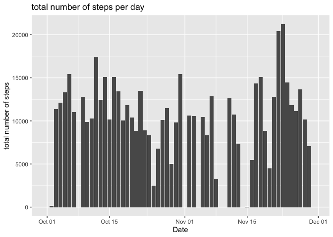
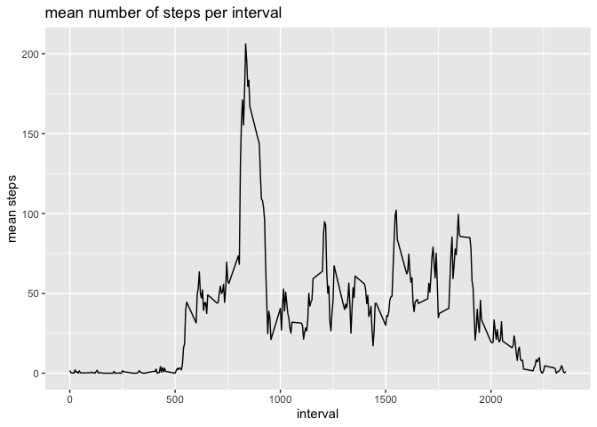
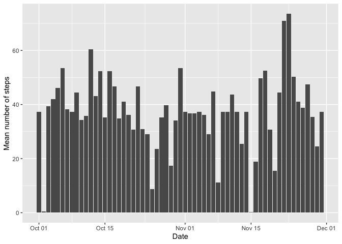
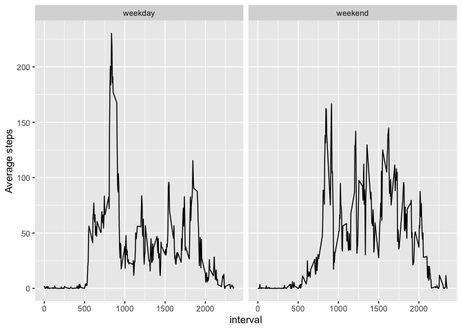

# Load libraries

```r
library(dplyr)
```

```
## 
## Attaching package: 'dplyr'
```

```
## The following objects are masked from 'package:stats':
## 
##     filter, lag
```

```
## The following objects are masked from 'package:base':
## 
##     intersect, setdiff, setequal, union
```

```r
library(lubridate)
```

```
## 
## Attaching package: 'lubridate'
```

```
## The following objects are masked from 'package:base':
## 
##     date, intersect, setdiff, union
```

```r
library(ggplot2)
```

## Loading and preprocessing the data


```r
zip_filename <- "activity.zip" # store document name
activity <- unz(zip_filename, "activity.csv") # unzip the file
activity <- read.csv(activity) # read the unzipped file as a csv file

str(activity) # have a look at the data to see whether it needs preprocessing
```

```
## 'data.frame':	17568 obs. of  3 variables:
##  $ steps   : int  NA NA NA NA NA NA NA NA NA NA ...
##  $ date    : chr  "2012-10-01" "2012-10-01" "2012-10-01" "2012-10-01" ...
##  $ interval: int  0 5 10 15 20 25 30 35 40 45 ...
```

```r
activity <- activity %>% 
  mutate(date = as.Date(date)) # we change the date variable from character type to a date variable
```

## What is mean total number of steps taken per day?

First we calculate the total of number of steps taken per day:


```r
activity %>%
  group_by(date) %>%
  summarize(totalSteps = sum(steps, na.rm = TRUE))
```

```
## # A tibble: 61 × 2
##    date       totalSteps
##    <date>          <int>
##  1 2012-10-01          0
##  2 2012-10-02        126
##  3 2012-10-03      11352
##  4 2012-10-04      12116
##  5 2012-10-05      13294
##  6 2012-10-06      15420
##  7 2012-10-07      11015
##  8 2012-10-08          0
##  9 2012-10-09      12811
## 10 2012-10-10       9900
## # ℹ 51 more rows
```

Now, we create a histogram with the total number of steps per day. 


```r
ggplot(activity %>%
  group_by(date) %>%
  summarize(totalSteps = sum(steps, na.rm = TRUE)),
  aes(x = date, y = totalSteps)) +
  geom_col() +
  labs(x = "Date", y = "total number of steps", title = ("total number of steps per day"))
```

<!-- -->

Here, we calculate and report the mean and median of the total number of steps taken per day


```r
steps_per_day <- activity %>%
  group_by(date) %>%
  summarize(totalSteps = sum(steps, na.rm = TRUE)) %>%
  summarise(mean_totalSteps = mean(totalSteps, na.rm = TRUE),
            median_totalSteps = median(totalSteps, na.rm = TRUE))
```

The mean total steps per day is: 9354.2295082 and the median number of steps per day is 10395

## What is the average daily activity pattern?

Make a time series plot (i.e. 
type = "l"
type = "l") of the 5-minute interval (x-axis) and the average number of steps taken, averaged across all days (y-axis)


```r
ggplot(activity %>%
         group_by(interval) %>%
         summarize(meanSteps = mean(steps, na.rm = TRUE)),
       aes(x = interval, y = meanSteps)) +
  geom_line() +
  labs(y = "mean steps", title = "mean number of steps per interval")
```

<!-- -->

Which 5-minute interval, on average across all the days in the dataset, contains the maximum number of steps?


```r
summaryInterval <- activity %>%
  group_by(interval) %>%
  summarize(meanSteps = mean(steps, na.rm = TRUE)) %>%
  filter(meanSteps == max(meanSteps))
```

We see that the interval 835 contains the maximum number of steps, which is 206.1698113 steps.

## Imputing missing values
Calculate and report the total number of missing values in the dataset (i.e. the total number of rows with NAs)


```r
activity %>%
  filter(is.na(steps)) %>%
  summarize(rowsMissing = n())
```

```
##   rowsMissing
## 1        2304
```

Devise a strategy for filling in all of the missing values in the dataset. The strategy does not need to be sophisticated. For example, you could use the mean/median for that day, or the mean for that 5-minute interval, etc. Create a new dataset that is equal to the original dataset but with the missing data filled in.

We will impute the missing values with the median values.


```r
library(dplyr)

# Calculate the mean steps per interval
interval_means <- activity %>%
  group_by(interval) %>%
  summarize(mean_steps = mean(steps, na.rm = TRUE))

# Merge the mean steps with the original dataset
activity <- activity %>%
  left_join(interval_means, by = "interval") %>%
  mutate(imputed_steps = ifelse(is.na(steps), mean_steps, steps)) %>%
  select(-mean_steps)  # Remove the temporary column
```


Make a histogram of the total number of steps taken each day and Calculate and report the mean and median total number of steps taken per day. Do these values differ from the estimates from the first part of the assignment? What is the impact of imputing missing data on the estimates of the total daily number of steps?


```r
ggplot(activity %>% group_by(date) %>% summarize(meanSteps = mean(imputed_steps)), 
       aes(x = date, y = meanSteps)) +
  geom_col() +
  labs(x = "Date", y = "Mean number of steps")
```

<!-- -->

Let's have a look at the differences between the steps variable and the steps variable with imputed values (mean values per interval) to see what the differences are.


```r
meanSteps <- mean(activity$steps, na.rm = TRUE)
meanImputedSteps <- mean(activity$imputed_steps)
```

We see that the mean number of steps (when removing the missing values) is 37.3825996, and when the NA-values are imputed with mean values this mean is also 37.3825996

## Are there differences in activity patterns between weekdays and weekends?
Create a new factor variable in the dataset with two levels – “weekday” and “weekend” indicating whether a given date is a weekday or weekend day.


```r
activity <- activity %>%
  mutate(weekday = ifelse(weekdays(date) %in% c("Monday", "Tuesday", "Wednesday", "Thursday", "Friday"), "weekday", "weekend"))
```

Make a panel plot containing a time series plot (i.e. type = "l") of the 5-minute interval (x-axis) and the average number of steps taken, averaged across all weekday days or weekend days (y-axis). See the README file in the GitHub repository to see an example of what this plot should look like using simulated data.


```r
ggplot(activity %>% group_by(weekday, interval) %>% summarize(meanSteps = mean(imputed_steps)),
       aes(x = interval, y = meanSteps)) +
         geom_line() +
         facet_grid(.~weekday) +
  labs(y = "Average steps")
```

```
## `summarise()` has grouped output by 'weekday'. You can override using the
## `.groups` argument.
```

<!-- -->


